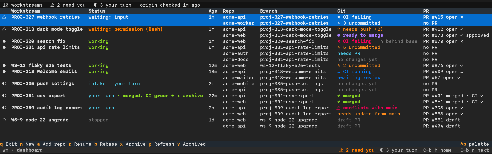

# wm: the task layer for Claude Code

**One ticket. Every repo it touches. One Claude Code conversation, kept on the rails.**

Other agent tools model a *session*: one agent, one repo, one branch. `wm` models a *task*: one ticket, N repos,
one conversation, N PRs and one definition of done.

- 🎙️ **Describe the task by voice or text.** Claude writes the brief and picks the repos it needs.
- 🌳 **An isolated git worktree per repo**, on a branch named after the ticket. Your main checkouts stay clean.
- 🛡️ **Strong guardrails.** No edits in your main checkouts, no branch switching, and **no agent writing over
  another's branch**.
- 🔄 **Live git status integration.** Git, PR and CI state for every repo, plus commits behind `main`, refreshed in
  the background.
- 🚦 **One dashboard for every task.** Who is waiting on you, and **what each repo needs next**, from "needs push"
  to "ready to merge".
- 🧹 **Archive that never loses work.** It refuses while anything is uncommitted or unpushed.
- 💻 **The real `claude` CLI on your subscription.** Local and terminal-native: no API keys, no cloud, no daemon.



## Quick start

Requires macOS, git, tmux, Claude Code, and optionally `gh` for PR and CI status.

```sh
brew install tmux
git clone https://github.com/inreachventures/agents-manager.git ~/code/agents-manager && cd ~/code/agents-manager
python3.12 -m venv .venv && .venv/bin/pip install -e .   # or: uv tool install -e .
ln -sf "$PWD/.venv/bin/wm" ~/.local/bin/wm               # Claude sessions call `wm` during intake
wm doctor                                                # checks tools, PATH and Claude folder trust

wm                                                       # opens the dashboard
```

Press `n` in the dashboard and describe the task in the Claude session that opens:

> "This is PROJ-313. Add a dark mode toggle: acme-api needs to store the preference and the web UI needs the
> toggle. Done when both are merged."

Claude names the workstream (`PROJ-313 dark mode toggle`), writes `TASK.md`, attaches `acme-api` and `acme-web` as
worktrees on `proj-313-dark-mode-toggle`, summarises the plan and waits for your **"go"**. Then press `C-b h` to go
back to the dashboard and get on with other work. When the PRs are merged, press `x` to archive.

## How wm compares

| | **wm** | Claude Code, built in | Agent Deck | Agent of Empires | Conductor | Claude Squad |
|---|:-:|:-:|:-:|:-:|:-:|:-:|
| One ticket across several repos: a worktree per repo, one conversation | ✅ | ◐ ¹ | ✅ | ✅ | ❌ | ❌ |
| The agent attaches repos itself mid-task, the manager creates worktree and branch | ✅ | ◐ ² | ❌ | ❌ | ❌ | ❌ |
| A task brief written at intake that survives compaction and resume | ✅ | ◐ ³ | ❌ | ❌ | ❌ | ❌ |
| Guardrails: no edits in your main checkouts, no branch switches, "do this instead" messages, drift detection | ✅ | ◐ ⁴ | ◐ ⁵ | ◐ ⁵ | ❌ | ❌ |
| What each repo needs next, from git + PR + CI, plus commits behind base | ✅ | ◐ ⁶ | ❌ | ❌ | ✅ ⁷ | ❌ |
| Rebase every repo of the task on request, conflicts handed back to the agent | ✅ | ❌ | ❌ | ❌ | ❌ | ❌ |
| Archive that refuses to lose work, unarchive into the same conversation | ✅ | ◐ ⁸ | ◐ | ◐ | ◐ | ❌ |
| Adopt work in progress (branch and uncommitted changes) from a normal checkout | ✅ | ❌ | ◐ | ◐ ⁹ | ◐ ⁹ | ❌ |
| Sessions outlive the terminal, with "needs you" status | ✅ | ✅ | ✅ | ✅ | ◐ | ◐ |
| Real `claude` CLI on your subscription, in your terminal | ✅ | ✅ | ✅ | ✅ | ◐ ¹⁰ | ✅ |

✅ yes · ◐ partly · ❌ not in the project's docs. Checked against each project's public docs on 2 October 2026. These
tools move fast; if a cell is wrong, please open an issue.

1. `--add-dir` shares other repos without isolating them; `--worktree` covers only the repo you launch from;
   multi-repo threads exist in cloud Projects (beta).
2. `/add-dir` gives access to another folder, without a worktree or a branch.
3. Cloud Projects only.
4. Deny rules and hooks to build your own policy; `--worktree` sessions can't write to the main checkout.
5. Container sandboxes.
6. A PR badge for the current branch of one repo.
7. One repo per workspace.
8. One repo at a time: `claude rm` refuses unpushed commits.
9. Starting from an existing branch; uncommitted changes aren't carried over.
10. A macOS app built around Claude Code, not a terminal tool.

**wm doesn't replace Claude Code's agent view.** Agent view is a great way to watch plain sessions. `wm` adds the
layer Claude Code leaves to you: what a session is for, which repos it may touch, and when the task is done.

## How it works

A workstream is one task: a key (`PROJ-313`, or `WS-7` without a ticket), a 3-word name, and a folder holding one
git worktree per repo and exactly one Claude Code conversation at its root:

```text
~/workstreams/PROJ-313/          ← Claude's working directory
    CLAUDE.md                    ← generated by wm: identity, repos, branches, rules
    TASK.md                      ← the brief Claude writes at intake: goal, done-when, decisions
    .claude/settings.json        ← generated: status hooks, guard hooks, deny rules
    acme-api/                    ← git worktree on proj-313-dark-mode-toggle
    acme-web/                    ← git worktree on proj-313-dark-mode-toggle
```

**The agent asks, `wm` builds.** Claude never creates worktrees, switches branches or deletes anything. When it
needs another repo it runs `wm add-repo`, and `wm` creates the worktree and the branch.

- **Voice-first intake.** Claude names the task, writes `TASK.md` and attaches the repos, fuzzy-matching dictated
  names.
- **One memory for all tasks.** What Claude learns about how you work is saved once and loaded in every
  workstream; facts about a single task stay in its `TASK.md`.
- **Survives compaction.** `CLAUDE.md` and `TASK.md` reload after compaction and on resume, with live git and PR
  state.
- **Guardrails that redirect.** Edits outside the workstream, git writes in `~/code/<repo>`, `git switch`,
  `checkout`, `worktree` and `clone` are blocked **with a "do this instead" message**. Drift is caught after every
  command.
- **The next step for each repo.** `✎ uncommitted`, `↑ needs push`, `needs PR`, `✗ CI failing`,
  `● ready to merge`, `✓ merged`, plus "N behind base".
- **Rebase the whole task.** Every branch behind its base, force-pushed with a lease. **Conflicts go back to
  Claude.**
- **Archive that won't lose work.** **Refuses on uncommitted, unpushed or post-merge commits.** Restoring brings
  back the worktrees and the conversation.
- **Adopt work in progress.** Claude can move a branch and its uncommitted changes from a normal checkout into the
  workstream, and **rolls back if any step fails**.
- **Outlives your terminal.** Sessions run in `wm`'s own tmux server, with "needs you" status and macOS
  notifications.

## Usage

You only need two places: the dashboard (run `wm`) and the Claude sessions it opens.

**From the dashboard:**

| Key | What it does |
|---|---|
| `n` | New workstream: a Claude session opens and you describe the task |
| `enter` | Jump into the selected workstream's Claude session |
| `a` | Attach another repo to the selected workstream |
| `r` | Resume a stopped session, in the same conversation (after a reboot, say) |
| `b` | Rebase every branch of the task that is behind its base; conflicts go to Claude |
| `x` | Archive: safety check, then stop the session and remove the worktrees |
| `v` | Show archived workstreams; `u` restores one with its worktrees and conversation |
| `p` | Refresh git, PR and CI state now |
| `q` | Leave the dashboard; sessions keep running |

Anywhere in `wm`'s tmux: `C-b h` back to the dashboard · `C-b n` next session waiting on you · `C-b d` detach.

**From the chat:** ask Claude, and it runs `wm` for you.

- *"We also need acme-mobile."* Claude attaches the repo.
- *"Continue the work I have in web."* Claude moves your branch and uncommitted changes from `~/code/web` into the
  workstream, after showing you the plan.

Whichever way a repo joins, `wm` guarantees it **lives as a worktree inside the workstream folder**, on the task's
branch, **listed in the task's `CLAUDE.md` and covered by its guardrails**.

Optional config in `~/.agents-manager/config.toml`:

```toml
code_roots = ["~/code"]            # where your repos live; their checkouts are protected
workstreams_dir = "~/workstreams"  # where workstream folders are created
```

## Limits

- **macOS and Claude Code only.** Notifications use `osascript`; status and guardrails are built on Claude Code hooks.
- **The shell-command check is best-effort.** A command written to get around it can slip past; drift detection
  catches the result, not the attempt. There's no OS-level sandbox yet.
- **Repo-level Claude settings don't apply.** Each repo's `CLAUDE.md` is loaded, but its `.claude/settings.json` and
  `.mcp.json` are not, because Claude Code only reads those from the working directory.
- **No diff viewer.** Review in your editor or on the PR. PR and CI state needs `gh` and GitHub.

## Disclaimer

**Use at your own risk.** This software is provided as is, without warranty of any kind (see `LICENSE`). `wm` runs
git commands that create and remove worktrees, delete branches, stash changes, rebase and force-push (with lease),
and it starts Claude Code sessions that change your code. The safety checks reduce the risk of losing work, but they
are not a guarantee. The authors are not responsible for any data loss or other damage resulting from its use. Keep
your work committed and pushed, and keep backups.

## Develop

```sh
.venv/bin/pytest -q
.venv/bin/ruff check src tests
```

`DESIGN.md` explains the reasoning behind each design decision. MIT licensed, see `LICENSE`.
